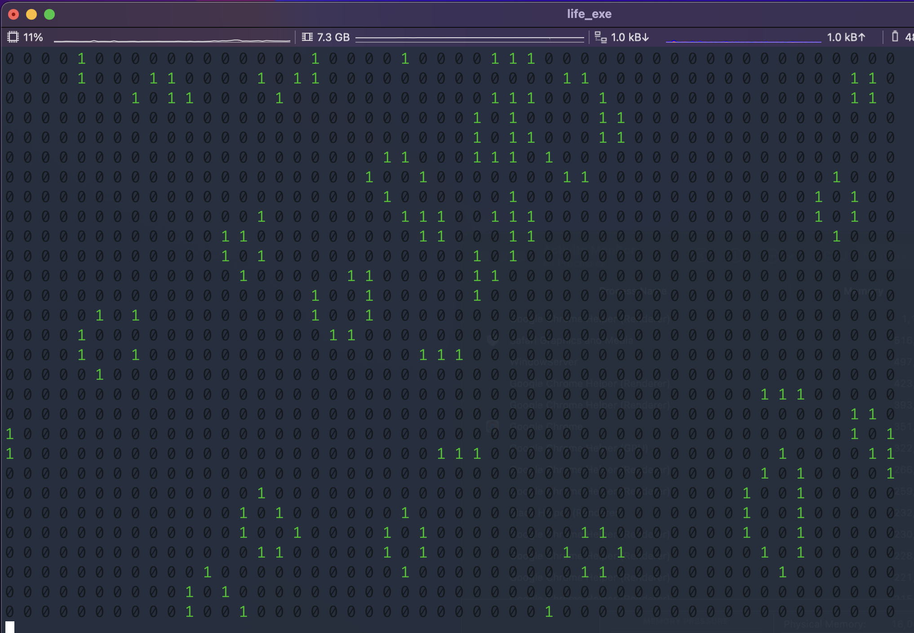

# Famous Game of Live algorithm implemented in C Language

## Can be compiled and launched in terminal

To create executable RUN (if you have "gcc" or "clang" compiler):

    make

If you have another compiler, you need to update it in the Make file,
first row

    CC="your_compiler_name"

Example

